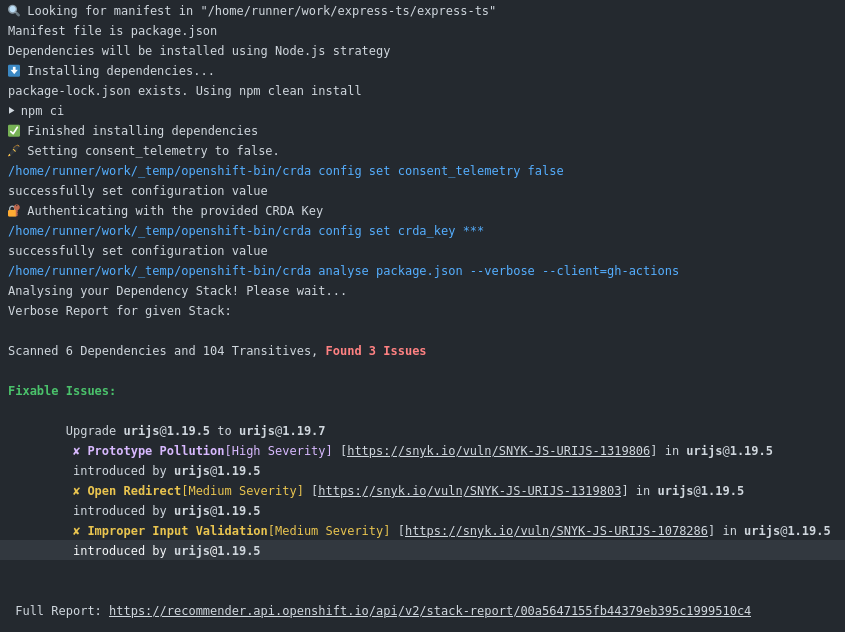
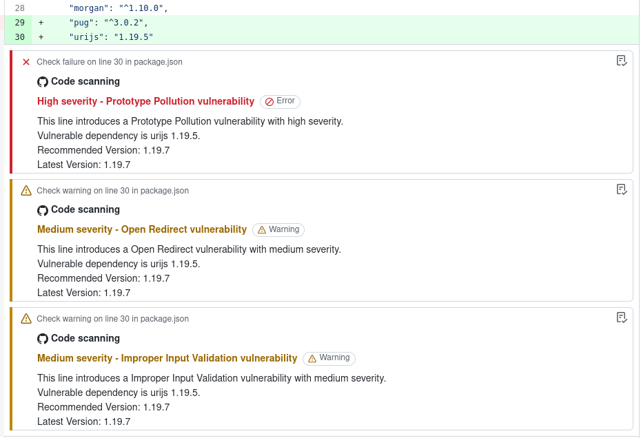

# CodeReady Dependency Analytics (crda)

[](https://github.com/redhat-actions/crda/actions/workflows/ci.yml)
[](https://github.com/redhat-actions/crda/actions/workflows/link_checker.yml)
<br>
<br>
[](https://github.com/redhat-actions/crda/actions/workflows/scan_go.yml)
[](https://github.com/redhat-actions/crda/actions/workflows/scan_java.yml)
[](https://github.com/redhat-actions/crda/actions/workflows/scan_node.yml)
[](https://github.com/redhat-actions/crda/actions/workflows/scan_python.yml)
<br>
<br>
[](https://github.com/redhat-actions/crda/tags)
[](./LICENSE)
[](./dist)

**crda** is a GitHub Action which uses [**CodeReady Dependency Analytics**](https://github.com/fabric8-analytics/cli-tools/blob/main/docs/cli_README.md) to analyze vulnerabilities in a project's dependencies.

The scan's result is uploaded to the GitHub repository as a [SARIF](https://sarifweb.azurewebsites.net/) file, and vulnerabilities found are reported to repository maintainers in the **Security** tab.

CRDA supports Go, Java, Node.js, and Python projects.

CRDA is [integrated with Snyk](https://snyk.io/blog/snyk-integration-with-red-hat-codeready-dependency-analytics/) to provide excellent analysis by referencing a database of known vulnerabilities.

Read more about CRDA in [this blog post](https://developers.redhat.com/blog/2020/08/28/vulnerability-analysis-with-red-hat-codeready-dependency-analytics-and-snyk).

<a id="prerequisites"></a>

## Configuration

You can refer to [the examples in this repository](./.github/workflows) for a simple example of scanning each supported language. Or, skip to the [example below](#example).

### 1. Set up the tool stack
Unless already done, you must set up the tool stack for your project.

Refer to the setup actions for:
  - [Go](https://github.com/actions/setup-go)
  - [Java](https://github.com/actions/setup-java)
  - [Node.js](https://github.com/actions/setup-node)
  - [Python](https://github.com/actions/setup-python)

### 2. Install the CRDA command line interface
Use the [**OpenShift Tools Installer**](https://github.com/redhat-actions/openshift-tools-installer) to install the CRDA CLI from GitHub.

<a id="installing-dependencies"></a>
### 3. Installing Dependencies
The project must have a dependencies manifest file which CRDA can read to install and analyze dependencies.

By default, CRDA will install dependencies using a standard command for the project type as described in the table below. This can be overridden with the `deps_install_cmd` input.

Use the `manifest_directory` input if your project is not in the working directory. The install command will execute in this directory.

Use the `manifest_file` input if your manifest file is named differently than the table below. The file must exist in the `manifest_directory`. If this input is omitted, the `manifest_directory` will be searched for the files in the table below.

Refer to the [Action Inputs](#action-inputs) section for more information.

| Project Type   | Default `manifest_file` | Default Install Command |
| -------------- | --------------------- | ---------------------------- |
| Go             | `go.mod`            | `go mod vendor`              |
| Java           | `pom.xml`           | `mvn -ntp -B package`     |
| Node.js (npm)  | `package.json`, `package-lock.json` | `npm ci` |
| Node.js (yarn) | `package.json`, `yarn.lock` | `yarn install --frozen-lockfile` |
| Python         | `requirements.txt` | `pip install -r requirements.txt` |

<a id="authentication"></a>
### 4. Set Up Authentication

For authentication, you must provide either a CRDA Key or a Synk Token.

The token must be stored in a [repository secret](https://docs.github.com/en/actions/reference/encrypted-secrets).

#### Snyk Token
1. [Sign up for Synk](https://app.snyk.io/login?utm_campaign=Code-Ready-Analytics-2020&utm_source=code_ready&code_ready=FF1B53D9-57BE-4613-96D7-1D06066C38C9).
2. Click through the wizard. You do not need to provide it any permissions if you don't want to.
3. Go to `Account settings` to find your Synk Token (aka "key").
4. Provide the token in the `synk_token` input.

#### CRDA Key (Optional)
1. First, obtain a Snyk token.
2. [Install the CRDA CLI locally](https://github.com/fabric8-analytics/cli-tools/blob/main/docs/cli_README.md)
3. Run `crda auth`. Provide the Snyk token so the CRDA Key can also access the Synk database.
4. Extracted the CRDA Key from the output or `$HOME/.crda/config.yaml`.
5. Provide the CRDA Key in the `crda_key` input.

You only need to provide one of the two authentication tokens.

<a href="example"></a>
## Example

The example workflow job below shows how the **crda** action can be used to scan vulnerabilities in a Node.js project and upload the result to GitHub.

```yaml
steps:
 - name: Checkout
   uses: actions/checkout@v2
   with:
    repository: nodejs/examples

- name: Set up Node.js
  uses: actions/setup-node@v2
  with:
    node-version: '14'

- name: Install CRDA
  uses: redhat-actions/openshift-tools-installer@v1
  with:
    source: github
    crda: latest

- name: CRDA Scan
  id: crda_scan
  uses: redhat-actions/crda@v1
  with:
    crda_key: ${{ secrets.CRDA_KEY }}

- name: Print Report Link
  run: echo ${{ steps.crda_scan.outputs.report_link }}
```
The following snapshot is an example of a CRDA run on a Node.js project.



<a id="action-inputs"></a>
## Action Inputs

| Input | Description | Default |
| ----- | ----------- | --------- |
| crda_key | Existing CRDA key to identify the existing user. | **Required** unless `synk_token` is set
| snyk_token | Snyk token to be used to authenticate to the CRDA | **Required** unless `crda_key` is set
| analysis_report_name | Name of the analysis report files. A `.json` and a `.sarif` file will be created. | `crda_analysis_report`
| consent_telemetry | CRDA collects anonymous usage data. Enable this to help make CRDA better for our users. Refer to the [privacy statement](https://developers.redhat.com/article/tool-data-collection) for more details. | `false`
| deps_install_cmd | Command to use for the dependencies installation instead of using the default. | [View defaults](#installing-dependencies)
| fail_on | Configure if the workflow should fail if a vulnerability of this level or higher is found in the project. This can be `error` to fail only on errors, `warning` to fail on warnings or errors, or `never` to always pass the step.| `error`
| github_token | GitHub token used to upload the SARIF report to GitHub. The token must have `security_events` write permission. | [`${{ github.token }}`](https://docs.github.com/en/actions/reference/authentication-in-a-workflow#about-the-github_token-secret)
| manifest_directory | Path to the directory where the project's manifest is. | Working directory
| manifest_file | File name (basename) of the manifest file to use for analysis. This file must exist in the `manifest_directory`. If not specified, the action will scan the `manifest_directory` for any of the expected manifest files. | [View defaults](#installing-dependencies) |
| upload_sarif | Whether or not to upload the generated SARIF file. If this is disabled, vulnerabilities will not be reported in the Security tab. | `true`

## Action Outputs

- **crda_report_json**: Path to generated CRDA analysis report in JSON format.
- **crda_report_sarif**: Path to generated CRDA analysis report in SARIF format.
- **report_link**: CRDA Analysis report link.

<a id="pr-support"></a>

## Scanning Pull Requests

This action can run CRDA scans on pull requests. Because the action must check out the pull request's code in order to scan it, the [`pull_request_target` trigger](https://docs.github.com/en/actions/reference/events-that-trigger-workflows#pull_request_target) must be used.

Since the pull request's code will be checked out in order to install dependencies, repository maintainers must **manually verify** that the pull request does not include any malicious code before the scan can run. Maintainers can approve the CRDA scan by adding the `CRDA Scan Approved` label.

Each time a new commit is pushed to the pull request, the `Approved` label will be removed. A maintainer must review the code again and re-add the label, to prevent malicious code from executing due to the prior approval.

After the CRDA scan is approved and the workflow runs, a label indicating the scan result will be added to the pull request.

The following snapshot shows vulnerability details in the GitHub UI for a pull request.



> **Note**: Pull requests authored by users with write access to the repository will automatically receive the `CRDA Scan Approved` label.

Use the following snippet to enable pull request scans in your repository:
``` yaml
on:
  pull_request_target:
    # These types are all required for CRDA to scan pull requests correctly and securely.
    types: [ opened, synchronize, reopened, labeled, edited ]
```
